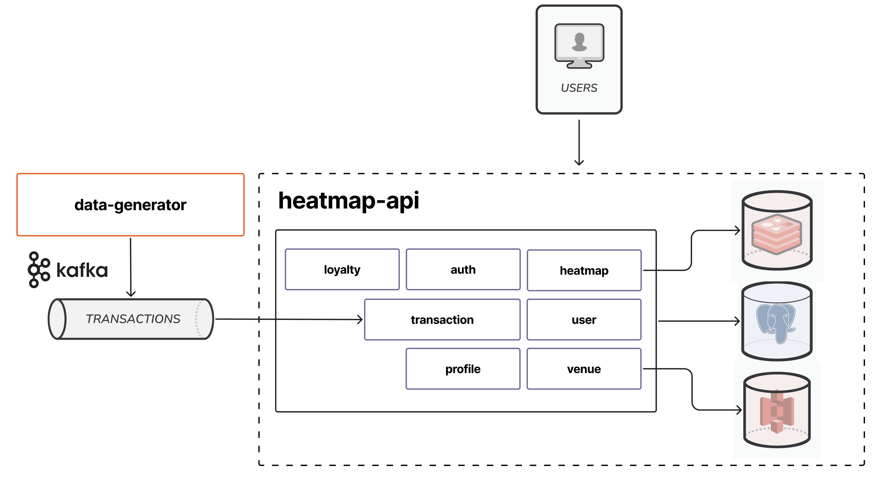

# T-Map – Карта живого города

Тепловая карта городской активности на основе обезличенных транзакционных данных.  
Видишь в реальном времени — где сейчас людно, где пусто, где аномальный ажиотаж.

> Серверная часть проекта T-Map, разработанная командой бэкенда в рамках проектного практикума Т-Банка.

[](https://github.com/squ1ky/tmap-backend/actions/workflows/ci.yaml)
[](https://github.com/squ1ky/tmap-backend/actions/workflows/cd.yaml)


---

## Архитектура



Внутренняя архитектура `heatmap-api` — **Hexagonal / DDD**: каждый домен делится на
`domain → application → infrastructure → presentation`.

---

## Стек технологий

| Компонент        | Технология                         | Зачем                                       |
|------------------|------------------------------------|---------------------------------------------|
| Язык / фреймворк | Java 21 + Spring Boot 3.5          | основа всего                                |
| База данных      | PostgreSQL 16                      | основное хранилище                          |
| Брокер сообщений | Apache Kafka 3.9 (KRaft)           | поток транзакционных событий                |
| Кэш              | Redis                              | кэширование кластеров на карте              |
| Object Storage   | MinIO                              | фото заведений                              |
| Гео-индексация   | H3 4.1.1 (Uber)                    | шестиугольная сетка для тепловой карты      |
| Миграции         | Flyway                             | версионирование схемы БД                    |
| Аутентификация   | JWT (jjwt) + Refresh Token         | авторизация пользователей                   |
| API-контракт     | OpenAPI Generator                  | spec-first, интерфейсы генерируются из yaml |
| Мониторинг       | Prometheus + Grafana               | метрики и дашборды                          |
| Тестирование     | JUnit 5 + Mockito + Testcontainers | тестирование кода                           |
| Линтеры          | Checkstyle + PMD                   | качество кода                               |

---

## Требования

- Java 21
- Docker + Docker Compose
- Make

---

## Быстрый старт

```bash
cp .env.example .env
make dev
```

`make dev` поднимает PostgreSQL, Kafka, Redis и MinIO в Docker, затем запускает приложение локально с профилем `local`.

После старта:

| Сервис | URL |
|---|---|
| Swagger UI | http://localhost:8080/swagger-ui |
| MinIO Console | http://localhost:9001 |
| Prometheus | http://localhost:9090 |
| Grafana | http://localhost:3000 |

---

## Структура проекта

```
tmap-backend/
├── heatmap-api/          # основной REST API (Spring Boot)
│   └── src/main/java/ru/tbank/tmap/
│       ├── auth/         # JWT-аутентификация, refresh-токены
│       ├── heatmap/      # H3-тепловая карта, аномалии, история кластеров
│       ├── venue/        # заведения (public / business / admin)
│       ├── loyalty/      # QR-программы лояльности
│       ├── profile/      # профиль пользователя, история
│       └── shared/       # общие утилиты, error handling, geo-типы
│
├── data-generator/       # генератор транзакций (Kafka Producer)
│   └── src/main/java/ru/tbank/tmap/generator/
│       ├── scheduler/    # запуск по расписанию
│       ├── service/      # генерация событий и кэш заведений
│       └── kafka/        # публикация в топик transactions
│
├── docs/                 # стандарты команды (API, DB, Testing, Security, Git)
├── grafana/              # provisioning дашбордов и datasources
├── docker-compose.yaml   # полный стек (БД, Kafka, Redis, MinIO, Prometheus, Grafana, API)
├── Makefile              # команды для разработки
└── prometheus.yaml       # конфигурация Prometheus
```

---

## API

Все эндпоинты доступны по базовому пути `/api/v1`. Полная спецификация — в Swagger UI.

### Роли пользователей

| Роль             | Доступ                                                   |
|------------------|----------------------------------------------------------|
| `Нет роли`       | просмотр карты и заведений                               |
| `USER`           | профиль, qr-лояльность                                   |
| `BUSINESS_OWNER` | + управление своими заведениями и программами лояльности |
| `ADMIN`          | + модерация заведений и пользователей                    |

---

### Auth — `/api/v1/auth`

| Метод | Путь | Описание |
|---|---|---|
| `POST` | `/auth/register` | Регистрация (email, password, nickname) |
| `POST` | `/auth/login` | Вход — `accessToken` в теле, `refreshToken` в HTTP-only cookie |
| `POST` | `/auth/refresh` | Обновление токена по refresh-cookie |
| `POST` | `/auth/logout` | Выход — инвалидирует refresh-токен |

---

### Тепловая карта — `/api/v1/heatmap`

| Метод | Путь                          | Описание                                                                        |
|-------|-------------------------------|---------------------------------------------------------------------------------|
| `GET` | `/heatmap/clusters`           | H3-кластеры в bbox (`swLat`, `swLng`, `neLat`, `neLng`, `resolution`, `window`) |
| `GET` | `/heatmap/clusters/{h3Index}` | Детали кластера: история активности и флаг аномалии                             |

---

### Заведения (публичные) — `/api/v1/venues`

| Метод | Путь                                     | Описание                                 |
|-------|------------------------------------------|------------------------------------------|
| `GET` | `/venues`                                | Заведения в bbox с фильтром по категории |
| `GET` | `/venues/search`                         | Полнотекстовый поиск по названию (`?q=`) |
| `GET` | `/venues/{id}`                           | Детальная страница заведения             |
| `GET` | `/venues/{id}/loyalty-rules`             | Активные программы лояльности заведения  |
| `GET` | `/venues/{id}/loyalty-rules/{ruleId}/qr` | Получить QR-код для активации (`USER`)   |

---

### Бизнес-кабинет — `/api/v1/business` (`BUSINESS_OWNER`)

**Заведения:**

| Метод    | Путь                          | Описание                                |
|----------|-------------------------------|-----------------------------------------|
| `POST`   | `/business/venues`            | Создать заведение (уходит на модерацию) |
| `GET`    | `/business/venues`            | Список своих заведений                  |
| `GET`    | `/business/venues/{id}`       | Детали своего заведения                 |
| `PUT`    | `/business/venues/{id}`       | Обновить заведение                      |
| `POST`   | `/business/venues/{id}/photo` | Загрузить фото (multipart)              |
| `DELETE` | `/business/venues/{id}/photo` | Удалить фото                            |

**Программы лояльности:**

| Метод  | Путь                                        | Описание                                     |
|--------|---------------------------------------------|----------------------------------------------|
| `GET`  | `/business/venues/{id}/loyalty-rules`       | Все правила лояльности заведения             |
| `POST` | `/business/venues/{id}/loyalty-rules`       | Создать программу лояльности                 |
| `GET`  | `/business/loyalty-rules/{id}`              | Детали программы лояльности                  |
| `PUT`  | `/business/loyalty-rules/{id}`              | Обновить программу                           |
| `POST` | `/business/loyalty-rules/{ruleId}/activate` | Активировать QR клиента (сканирование)       |
| `GET`  | `/business/loyalty-rules/{id}/history`      | История верификаций по программе (пагинация) |

---

### Администрирование — `/api/v1/admin` (`ADMIN`)

**Пользователи:**

| Метод   | Путь                        | Описание                                                                    |
|---------|-----------------------------|-----------------------------------------------------------------------------|
| `GET`   | `/admin/users/search`       | Поиск пользователей с фильтрами (nickname, email, role, blocked, пагинация) |
| `PATCH` | `/admin/users/{id}/block`   | Заблокировать пользователя                                                  |
| `PATCH` | `/admin/users/{id}/unblock` | Разблокировать пользователя                                                 |

**Заведения:**

| Метод  | Путь                        | Описание                                           |
|--------|-----------------------------|----------------------------------------------------|
| `GET`  | `/admin/venues`             | Список заведений с фильтром по статусу (пагинация) |
| `GET`  | `/admin/venues/{id}`        | Детали заведения для модерации                     |
| `POST` | `/admin/venues/{id}/verify` | Одобрить заведение                                 |
| `POST` | `/admin/venues/{id}/reject` | Отклонить с причиной                               |

---

### Профиль — `/api/v1/profile`

| Метод | Путь                       | Описание                                   |
|-------|----------------------------|--------------------------------------------|
| `GET` | `/profile`                 | Данные текущего пользователя               |
| `PUT` | `/profile/password`        | Смена пароля                               |
| `GET` | `/profile/loyalty/history` | История верификаций лояльности (пагинация) |

---

## Мониторинг

Приложение экспортирует метрики через Spring Actuator в формате Prometheus. В compose поднимаются Prometheus и Grafana с преднастроенными дашбордами.

| Сервис     | URL                   |
|------------|-----------------------|
| Prometheus | http://localhost:9090 |
| Grafana    | http://localhost:3000 |

Логин Grafana: `admin` / значение `GRAFANA_ADMIN_PASSWORD` из `.env`.

---

## Конфигурация

Скопируй `.env.example` в `.env` и при необходимости измени значения:

| Переменная                    | По умолчанию            | Описание                 |
|-------------------------------|-------------------------|--------------------------|
| `SERVER_PORT`                 | `8080`                  | Порт приложения          |
| `DB_HOST / DB_PORT / DB_NAME` | `localhost:5432/tmap`   | Подключение к PostgreSQL |
| `KAFKA_BOOTSTRAP_SERVERS`     | `localhost:9094`        | Kafka bootstrap          |
| `KAFKA_TRANSACTIONS_TOPIC`    | `transactions`          | Топик транзакций         |
| `MINIO_ENDPOINT`              | `http://localhost:9000` | S3-совместимое хранилище |
| `MINIO_BUCKET`                | `tmap`                  | Бакет для файлов         |
| `JWT_SECRET`                  | `change-me-in-prod`     | JWT Secret               |
| `JWT_ACCESS_EXPIRATION`       | `15m`                   | TTL access token         |
| `JWT_REFRESH_EXPIRATION`      | `7d`                    | TTL refresh token        |
| `GRAFANA_ADMIN_PASSWORD`      | `grafanapassword`       | Пароль Grafana           |

---

## Команды

| Команда                          | Что делает                                        |
|----------------------------------|---------------------------------------------------|
| `make dev`                       | БД + Kafka + MinIO в докере + приложение локально |
| `make up`                        | Всё в докере (прод-режим)                         |
| `make down`                      | Остановить всё                                    |
| `make db`                        | Поднять только БД                                 |
| `make logs`                      | Логи приложения в докере                          |
| `make build`                     | Собрать jar                                       |
| `make migrate name=create_users` | Создать новую Flyway-миграцию                     |
| `make lint`                      | Запустить все линтеры (Checkstyle + PMD)          |
| `make lint-checkstyle`           | Только Checkstyle                                 |
| `make lint-pmd`                  | Только PMD                                        |

---

## Тестирование

Тесты интеграционные — работают на реальных контейнерах через Testcontainers (PostgreSQL, Kafka).

```bash
./mvnw test
```

---

## Профили окружения

| Профиль | Когда используется                    |
|---------|---------------------------------------|
| `local` | локальная разработка (`make dev`)     |
| `prod`  | продакшн и docker-compose (`make up`) |

---

## Документация команды

| Документ                                        | Тема                                              |
|-------------------------------------------------|---------------------------------------------------|
| [CODING_STANDARDS.md](docs/CODING_STANDARDS.md) | Стандарты кода, соглашения по именованию, API     |
| [GIT_CONVENTIONS.md](docs/GIT_CONVENTIONS.md)   | Ветвление, коммиты, процесс PR                    |
| [docs/standards/](docs/standards/)              | Детальные стандарты: API, БД, тесты, безопасность |
